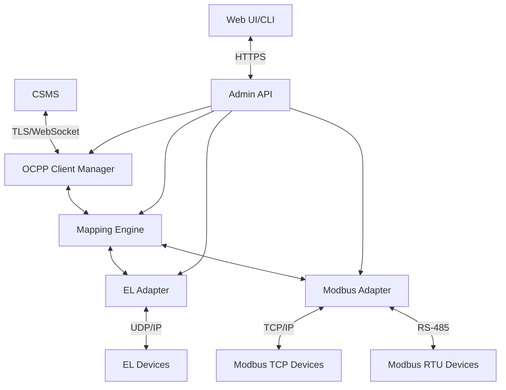

# Design Document: OCPP 2.0.1 Gateway Middleware

## Overview

The OCPP 2.0.1 Gateway Middleware is designed to bridge the gap between legacy charging equipment (using ECHONET Lite and Modbus protocols) and modern OCPP 2.0.1 charging networks. This middleware acts as a protocol translator and connection manager, enabling up to 100 charging stations to be integrated into a Central System Management System (CSMS) without requiring firmware modifications to the charging equipment.

The system is implemented in C++ for Linux-based embedded systems, with a focus on reliability, performance, and security. It provides a flexible configuration mechanism through external mapping files that define how OCPP variables correspond to device-specific registers or EPCs.

## Architecture

The architecture follows a modular design with clear separation of concerns to enable maintainability, testability, and future extensibility. The system is structured into the following major components:



### Core Components

1. **OCPP Client Manager**: Responsible for maintaining WebSocket connections to the CSMS, handling OCPP message serialization/deserialization, and managing the state machines for each virtual EVSE (Electric Vehicle Supply Equipment).

2. **Mapping Engine**: The central component that translates between OCPP variables and device-specific protocols. It loads mapping configurations from external YAML/JSON files and maintains an in-memory representation for efficient lookups.

3. **Device Adapters**:
   - **EL Adapter**: Handles communication with ECHONET Lite devices over UDP/IP, including multicast discovery, frame assembly/parsing, and retransmission logic.
   - **Modbus Adapter**: Supports both Modbus RTU (over RS-485) and Modbus TCP, handling request queuing, CRC verification, and error management.

4. **Admin API**: Provides a REST API and CLI for device registration, configuration management, and metrics reporting. Secured with authentication tokens and HTTPS.

5. **Web UI/CLI**: User interface for system administration, monitoring, and configuration.

## Components and Interfaces

### OCPP Client Manager

**Responsibilities:**
- Create and maintain WebSocket connections to the CSMS
- Implement the OCPP 2.0.1 protocol (message serialization/deserialization)
- Manage state machines for each virtual EVSE
- Handle OCPP message routing and queueing
- Implement offline transaction storage and forwarding

**Interfaces:**
- **To CSMS**: WebSocket over TLS 1.2/1.3
- **To Mapping Engine**: Internal C++ interface for bidirectional communication
- **To Admin API**: Internal C++ interface for configuration and monitoring

**Implementation Details:**
- Uses Boost.Asio or websocketpp for asynchronous WebSocket communication
- JSON processing with a library like nlohmann/json or RapidJSON
- State machine implementation using a state pattern or a library like Boost.MSM
- Persistent storage for offline transactions using SQLite or similar

### Mapping Engine

**Responsibilities:**
- Load and parse mapping configuration files
- Translate between OCPP variables and device-specific registers/EPCs
- Handle data type conversions, scaling, and enumeration mapping
- Monitor configuration files for changes and reload when necessary

**Interfaces:**
- **To OCPP Client Manager**: Internal C++ interface
- **To Device Adapters**: Internal C++ interface
- **To Admin API**: Internal C++ interface for configuration

**Implementation Details:**
- YAML/JSON parsing using yaml-cpp or nlohmann/json
- In-memory data structures for efficient lookups
- File system monitoring for configuration changes
- Template-based configuration system with inheritance

### EL Adapter

**Responsibilities:**
- Manage UDP socket communication
- Implement ECHONET Lite protocol (frame assembly/parsing)
- Handle device discovery via multicast
- Implement retransmission and timeout logic

**Interfaces:**
- **To Mapping Engine**: Internal C++ interface
- **To EL Devices**: UDP/IP on port 3610
- **To Admin API**: Internal C++ interface for configuration and monitoring

**Implementation Details:**
- Uses synchronous I/O with timestamp-based response matching
- Implements ECHONET Lite frame structure according to the specification
- Manages device state and connection status

### Modbus Adapter

**Responsibilities:**
- Support both Modbus RTU (RS-485) and Modbus TCP
- Implement request queuing and response handling
- Handle CRC verification and error management
- Manage connection pools for Modbus TCP

**Interfaces:**
- **To Mapping Engine**: Internal C++ interface
- **To Modbus TCP Devices**: TCP/IP on port 502
- **To Modbus RTU Devices**: RS-485 serial communication
- **To Admin API**: Internal C++ interface for configuration and monitoring

**Implementation Details:**
- Uses libmodbus as a base with custom state machine extensions
- Implements connection pooling for Modbus TCP
- Manages polling cycles and device timeouts
- Handles up to 25 devices per RS-485 bus

### Admin API

**Responsibilities:**
- Provide REST API for configuration and monitoring
- Implement CLI commands for system management
- Handle authentication and authorization
- Expose metrics for external monitoring systems

**Interfaces:**
- **To Web UI/CLI**: HTTPS REST API
- **To Core Components**: Internal C++ interfaces
- **To Monitoring Systems**: REST API or Prometheus exporter

**Implementation Details:**
- Uses a lightweight HTTP server like Crow or Pistache
- OpenAPI (Swagger) definition for API documentation
- JWT or similar for authentication tokens
- RBAC for authorization

## Data Models

### Configuration Data Models

#### System Configuration

```yaml
system:
  log_level: INFO
  log_rotation:
    max_size_mb: 10
    max_files: 5
  metrics:
    prometheus_port: 9090
  security:
    tls_cert_path: "/etc/ocpp-gw/certs/server.crt"
    tls_key_path: "/etc/ocpp-gw/certs/server.key"
    ca_cert_path: "/etc/ocpp-gw/certs/ca.crt"
    client_cert_required: false
```

#### CSMS Configuration

```yaml
csms:
  url: "wss://csms.example.com/ocpp"
  reconnect_interval_sec: 30
  max_reconnect_attempts: 10
  heartbeat_interval_sec: 300
```

#### Device Configuration

```yaml
devices:
  - id: "CP001"
    template: "vendor_x_model_y"
    protocol: "modbus_tcp"
    connection:
      ip: "192.168.1.100"
      port: 502
      unit_id: 1
    ocpp_id: "CP001"
  - id: "CP002"
    template: "vendor_z_model_a"
    protocol: "modbus_rtu"
    connection:
      port: "/dev/ttyS0"
      baud_rate: 9600
      data_bits: 8
      stop_bits: 1
      parity: "none"
      unit_id: 2
    ocpp_id: "CP002"
  - id: "CP003"
    template: "vendor_el_model"
    protocol: "echonet_lite"
    connection:
      ip: "192.168.1.101"
    ocpp_id: "CP003"
```

#### Mapping Template

```yaml
template:
  id: "vendor_x_model_y"
  description: "Vendor X Model Y Charger"
  variables:
    - ocpp_name: "AvailabilityState"
      type: "modbus"
      register: 40001
      data_type: "uint16"
      enum:
        0: "Available"
        1: "Occupied"
        2: "Reserved"
        3: "Unavailable"
        4: "Faulted"
    - ocpp_name: "MeterValue.Energy.Active.Import.Register"
      type: "modbus"
      register: 40010
      data_type: "float32"
      scale: 0.1
      unit: "kWh"
    - ocpp_name: "Connector.Status"
      type: "modbus"
      register: 40002
      data_type: "uint16"
      enum:
        0: "Available"
        1: "Occupied"
```

### Runtime Data Models

#### EVSE State

```cpp
struct EvseState {
    std::string id;
    ConnectorStatus status;
    AvailabilityStatus availability;
    std::optional<Transaction> currentTransaction;
    std::map<std::string, Variable> variables;
    std::chrono::time_point<std::chrono::system_clock> lastHeartbeat;
    bool connected;
};
```

#### Transaction

```cpp
struct Transaction {
    std::string id;
    std::string idTag;
    std::chrono::time_point<std::chrono::system_clock> startTime;
    std::optional<std::chrono::time_point<std::chrono::system_clock>> stopTime;
    std::vector<MeterValue> meterValues;
    TransactionStatus status;
};
```

#### MeterValue

```cpp
struct MeterValue {
    std::chrono::time_point<std::chrono::system_clock> timestamp;
    std::vector<SampledValue> sampledValues;
};

struct SampledValue {
    std::string value;
    std::string context;
    std::string format;
    std::string measurand;
    std::string phase;
    std::string location;
    std::string unit;
};
```

## Error Handling

The system implements a comprehensive error handling strategy to ensure robustness and reliability:

1. **Layered Error Handling**:
   - Each component handles errors at its own level when possible
   - Errors that cannot be handled locally are propagated up the stack
   - Critical errors trigger system-wide error handling procedures

2. **Error Categories**:
   - **Communication Errors**: Network failures, timeouts, protocol errors
   - **Configuration Errors**: Invalid configuration, missing files
   - **Runtime Errors**: Memory allocation failures, unexpected exceptions
   - **Business Logic Errors**: Invalid state transitions, protocol violations

3. **Recovery Strategies**:
   - **Automatic Retries**: For transient communication errors
   - **Circuit Breaker Pattern**: To prevent cascading failures
   - **Fallback Mechanisms**: Default values or degraded operation modes
   - **Graceful Degradation**: Maintain core functionality when possible

4. **Logging and Notification**:
   - All errors are logged with appropriate severity levels
   - Critical errors trigger notifications via configured channels
   - Error metrics are exposed for monitoring systems

5. **Specific Error Handling Cases**:
   - **CSMS Connection Loss**: Queue transactions, retry connection with exponential backoff
   - **Device Communication Failure**: Retry with configurable policy, mark as Faulted after threshold
   - **Configuration Errors**: Use last known good configuration, log detailed error information
   - **Protocol Violations**: Log detailed information, respond with appropriate error codes

## Testing Strategy

The testing strategy ensures comprehensive validation of the system at multiple levels:

1. **Unit Testing**:
   - Test individual components in isolation
   - Mock external dependencies
   - Focus on boundary conditions and error cases
   - Aim for 100% code coverage of critical paths

2. **Integration Testing**:
   - Test interactions between components
   - Verify correct data flow and transformations
   - Test configuration loading and application
   - Validate protocol implementations

3. **System Testing**:
   - End-to-end testing of the complete system
   - Test with simulated devices and CSMS
   - Verify all functional requirements
   - Test performance under load

4. **Conformance Testing**:
   - OCPP 2.0.1 conformance testing using official test tools
   - Verify compliance with protocol specifications
   - Test all required OCPP messages and sequences

5. **Performance Testing**:
   - Test with 100 simulated devices
   - Measure CPU usage, memory consumption, and response times
   - Verify performance meets requirements (CPU < 60%, latency < 500ms)

6. **Field Testing**:
   - 72-hour continuous operation test in a real environment
   - Verify zero transaction failures or system hangs
   - Monitor system behavior under real-world conditions

7. **Test Automation**:
   - Automated unit and integration tests as part of CI/CD pipeline
   - Automated performance testing for regression detection
   - Automated conformance testing for protocol compliance

## Security Considerations

1. **Transport Security**:
   - TLS 1.2/1.3 for all external communications
   - Server certificate validation
   - Optional client certificates for mutual authentication

2. **Authentication and Authorization**:
   - Token-based authentication for API access
   - Role-based access control for administrative functions
   - Secure credential storage

3. **Data Protection**:
   - Encrypted storage for sensitive configuration data
   - Secure handling of authentication tokens
   - Protection against data leakage

4. **Secure Development Practices**:
   - Regular security code reviews
   - Dependency scanning for vulnerabilities
   - Secure coding guidelines

5. **Operational Security**:
   - Principle of least privilege for system operation
   - Regular security updates
   - Audit logging of security-relevant events

## Deployment and Operations

1. **Deployment Options**:
   - Debian package (.deb) for standard Linux distributions
   - OTA update scripts for embedded systems
   - Docker container for development and testing

2. **Configuration Management**:
   - External configuration files in YAML/JSON format
   - Hot reload capability via SIGHUP or API endpoint
   - Version control for configuration templates

3. **Monitoring and Alerting**:
   - Prometheus metrics export
   - Health check endpoints
   - Configurable alerting thresholds

4. **Logging**:
   - Structured logging with severity levels
   - Log rotation and compression
   - Optional remote logging

5. **Backup and Recovery**:
   - Configuration backup procedures
   - Database backup for transaction history
   - Recovery procedures for system failure

6. **Scaling Considerations**:
   - Vertical scaling for increased device count
   - Resource allocation guidelines
   - Performance optimization recommendations